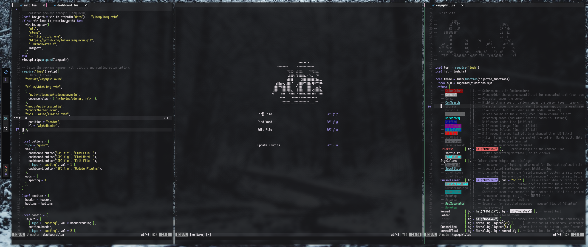

# radiant.nvim
`radiant.nvim` is a fast and minimal Neovim configuration framework; it aims to:
- Provide a solid base for *your* own configuration
- Help to make tailoring the Neovim experience simple and quick
- Create a consistent text editing experience for various common formats and files 
- [Be beautiful!](https://git.devraza.duckdns.org/devraza/kagayaki.nvim)

## Screenshots

This project is in its early stages of development. I consider it to be a functional text editor, but it still lacks a lot of features and isn't very mature. Stay tuned!
